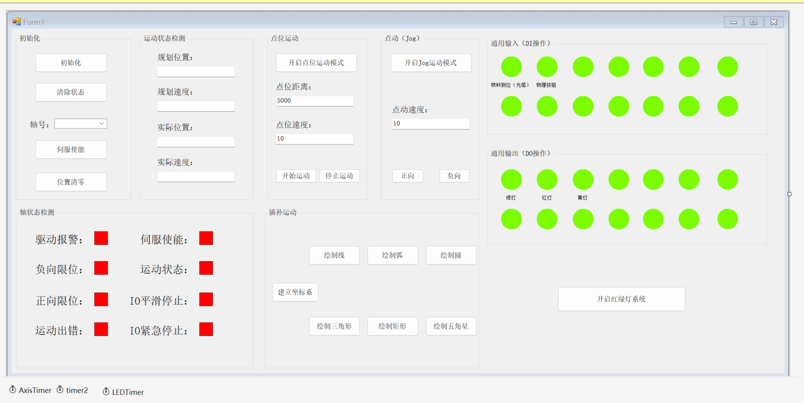

# GooGolDemo

基于固高运动控制卡与 C# WinForm 开发的上位机综合演示 Demo。

## 📖 项目简介
本项目是一个功能完善的运动控制上位机基础框架 Demo，展示了如何通过 C# WinForm 界面与底层运动控制卡进行交互。项目涵盖了板卡初始化、单轴运动、状态监控、通用 IO 操作以及基础的插补运动，适合作为工控上位机开发的入门参考。

## ✨ 功能模块

根据界面布局，本 Demo 包含以下核心功能：

### 1. 初始化与轴配置
- **板卡初始化**：在电脑上下载运动控制卡的调试工具，工具里初始化之后保存配置文件至debug，然后读取配置文件进行初始化
- **状态清除**：清除控制卡当前报警与错误状态。
- **轴号选择**：支持多轴切换操作。
- **伺服使能**：控制伺服电机上电/下电。
- **位置清零**：将当前轴坐标归零。

### 2. 运动状态检测
- 实时读取并显示轴的**规划位置**、**规划速度**。
- 实时读取并显示轴的**实际位置**、**实际速度**。

### 3. 点位运动 (P2P)
- 支持切换至**点位运动模式**。
- 可设置**点位距离**与**点位速度**。
- 提供**开始运动**与**停止运动**按钮。

### 4. 点动 (Jog) 控制
- 支持切换至 **Jog 运动模式**。
- 可设置**点动速度**。
- 提供**正向**与**负向**点动按钮（按住运动，松开停止）。

### 5. 通用输入 (DI) 操作
- 实时监控多路数字输入信号（如：物料到位、光幕、物理按钮等）。
- 绿色指示灯直观显示信号通断状态。

### 6. 通用输出 (DO) 操作
- 控制多路数字输出信号（如：绿灯、红灯、黄灯等）。
- 绿色指示灯显示当前输出状态。
- 底部提供**开启红绿灯系统**综合控制按钮。

### 7. 轴状态检测 (报警与限位)
- 实时监控并显示轴的异常与安全状态：
  - 驱动报警
  - 伺服使能状态
  - 负向限位 / 正向限位
  - 运动状态 / 运动出错
  - IO平滑停止 / IO紧急停止
- 红色指示灯表示触发/报警状态。

### 8. 插补运动 (基础)
- 提供建立坐标系功能。
- 支持基础轨迹插补绘制（UI预留）：
  - 绘制线、绘制弧、绘制圆
  - 绘制三角形、绘制矩形、绘制五角星

## 🛠️ 运行环境
- **开发工具**：Visual Studio 2019 / 2022
- **开发语言**：C#
- **界面框架**：Windows Forms (WinForm)
- **依赖库**：`EMC.Motion` / `LTDMC`（需安装对应运动控制卡的驱动及 SDK）
- **操作系统**：Windows 7 / 10 / 11

## 🚀 快速开始

1. **克隆项目**

   打开终端，执行以下命令：
   git clone https://github.com/KyrieLee1221/GooGolDemo.git

2. **配置参数**
   
    打开固高运动控制卡的本地调试工具，在工具里调整好配置参数并保存，然后把文件放置在bin/debug文件夹下，然后再程序里加载。
  
3. **编译运行**

   使用 Visual Studio 打开解决方案文件（.sln），确保已引用正确的运动控制卡动态库，然后编译运行。

4. **操作步骤**

   - 确保控制卡已上电并与电脑网线连接。
   - 点击“初始化”按钮。
   - 选择对应的轴号，点击“伺服使能”。
   - 设置好速度参数后，即可测试“点位运动”或“点动”。

## ⚠️ 注意事项
- **安全第一**：在进行运动测试前，请确保机械设备处于安全状态，建议先进行空载测试。
- **限位保护**：请确保硬件限位开关正常工作，避免发生机械碰撞。
- **参数配置**：首次使用请根据实际电机和机械结构，正确设置脉冲当量（Equiv）和速度参数。

## 📄 开源协议
本项目基于 MIT 协议开源，仅供学习与交流使用。
